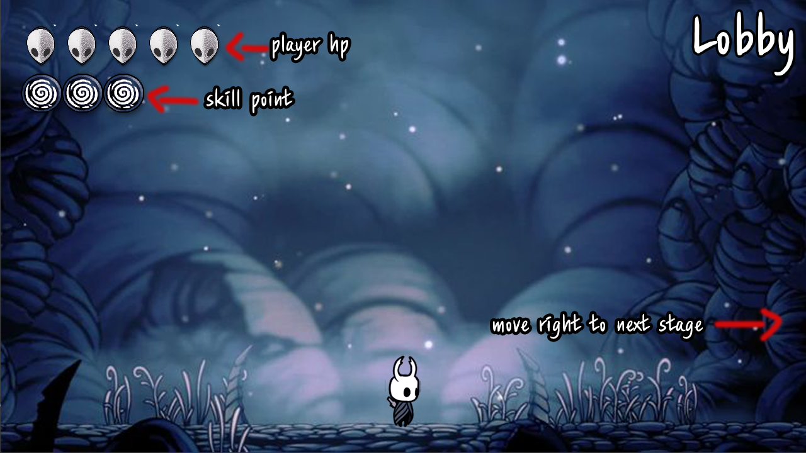

# 🌟 Hollow Knight 모작
2D Game Programming project (Hollow Knight 모작)

### 📺 발표 영상 링크
- Hollow Knight 1차 발표 링크: [YouTube 영상](https://youtu.be/Wv8ofTOpVJ4)  
- Hollow Knight 2차 발표 링크: [YouTube 영상](https://youtu.be/6aeq5mZfiAA)  
- Hollow Knight 최종 발표 링크: [YouTube 영상](https://youtu.be/sR2p8m20Mbs)  

## 🎮 Control Keys
- **a key**: Slash  
- **d key**: Dash  
- **s key**: Focus (health recovery)  
- **q key**: Fireball (requires skill points)  
- **Arrow keys**: Move  
- **Up arrow + a key**: Upslash  
- **Down arrow + a key**: Downslash  
- **Spacebar**: Jump  

## 🕹️ In Game Play (Example)
